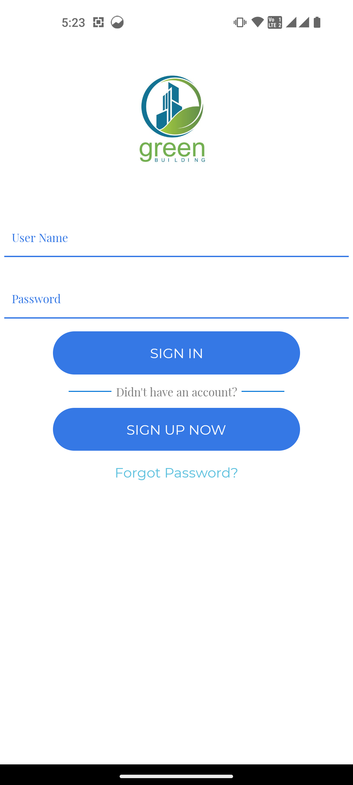
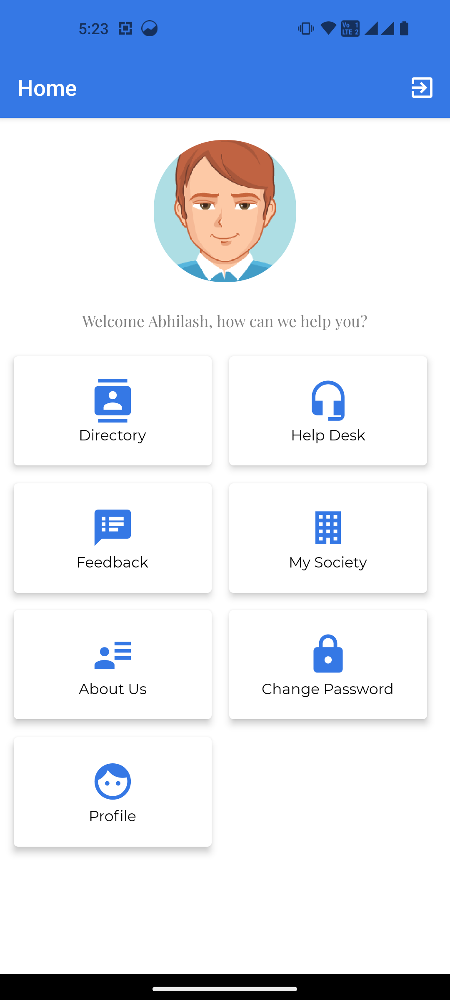
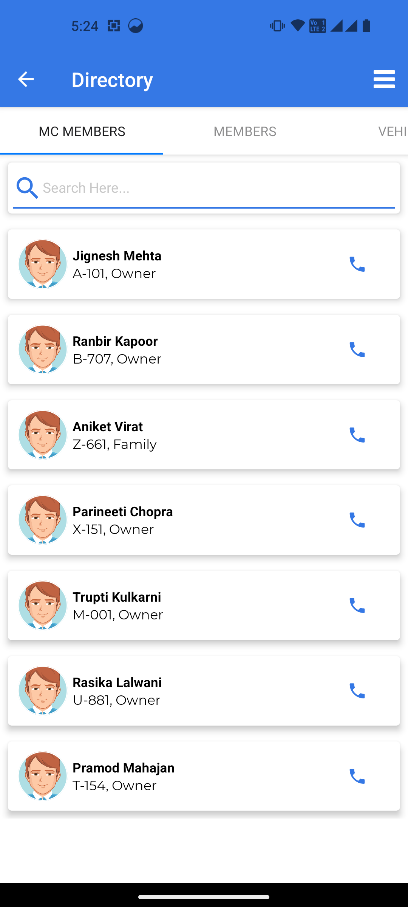
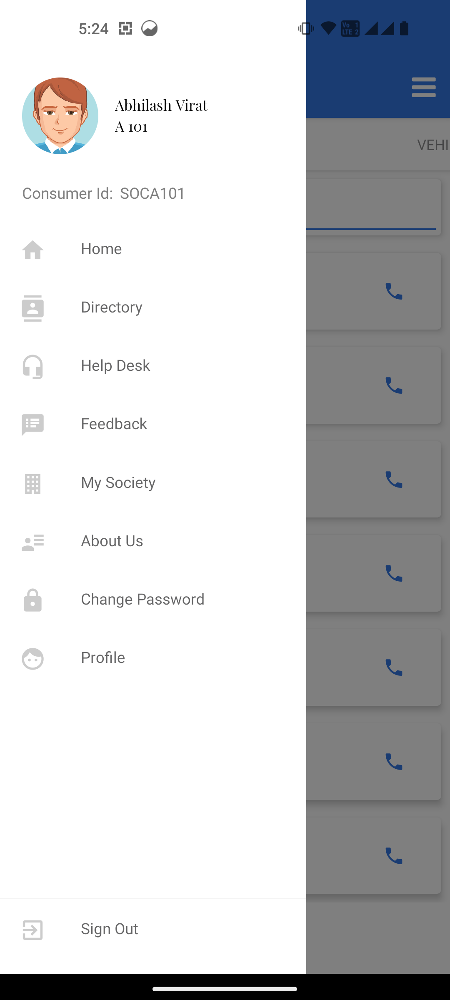
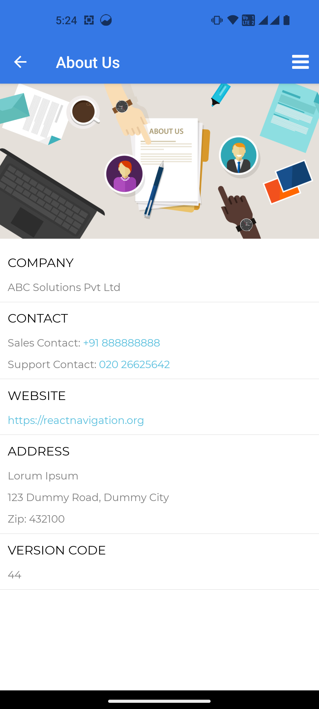
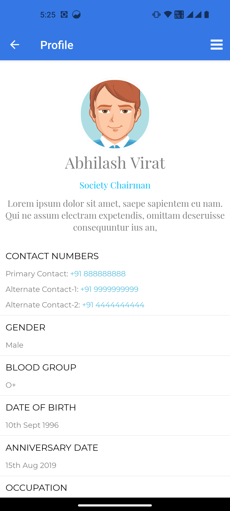
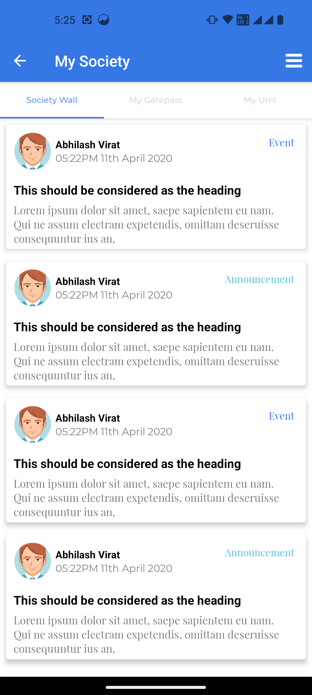
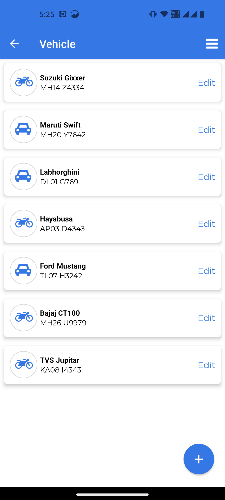

# Society Run

The society management app, designed for both Android and iOS platforms using react-native, it serves the purpose of managing activities within the community of a society.
Below are some of the screenshot for your refrance.

